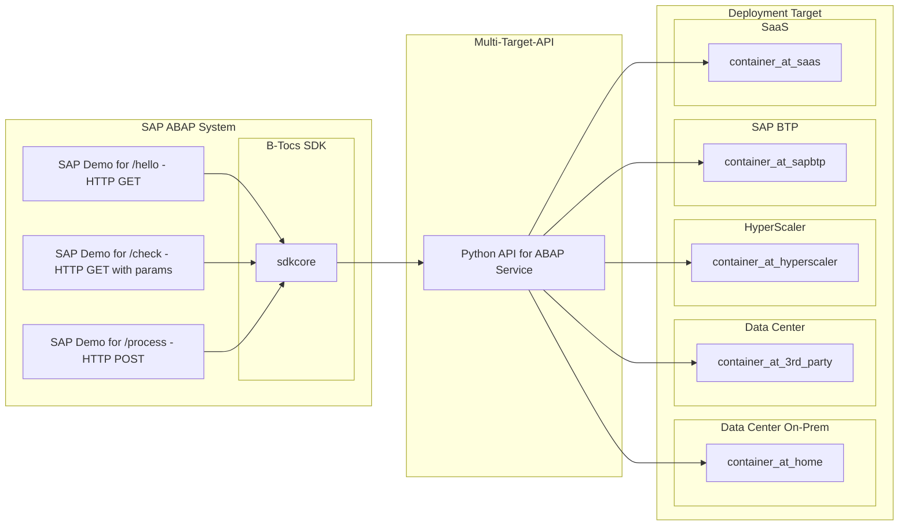

# B-Tocs Python API Template for SAP ABAP 

This repository is a simple template for building Python based APIs for SAP ABAP and multi target scenarios. The python API based on [FastAPI](https://fastapi.tiangolo.com/). For the ABAP part the [B-Tocs ABAP SDK](https://github.com/b-tocs/abap_btocs_core) is used.

## Big Picture

This project handles the following aspects:
1. Create a python based API
2. Call this API from SAP ABAP systems
3. Create a cloud native container for multi target deployment

## Step-By-Step Guide

1. Create a python based API
    1. [Install requirements - python, git, vsc](doc/requirements.md)
    2. [Create a new python project](doc/new_project.md)
    3. [Check the code and API](doc/check_code_and_api.md)
2. Call this API from SAP ABAP systems 
    1. [Expose API to the internet](doc/expose_api.md)
    2. [Connect SAP to the API](doc/connect_sap.md)
    3. [Call the API endpoints from ABAP programs](doc/call_api_from_sap.md)
    4. [Enable API Debugging](doc/enable_debugging.md)
3. Create a cloud native container for multi target deployment
    1. [Build and start local docker container](doc/docker_container.md)
    2. [Deploy the container image to a container registry](doc/container_image_deployment.md)
    3. [Use a container image for a target platform](doc/use_container_image.md)

### For ABAPers without Python interests

You can skip part 1 of the Step-By-Step Guide and start the python stack as local container as described in 3.3. Continue with 2.1 "Expose API ...".

## FAQ

### Where I can get more examples for using the B-Tocs ABAP SDK?

Check the project site of the [B-Tocs ABAP SDK](https://github.com/b-tocs/abap_btocs_core). There are some other projects listed using this SDK. The projects [LibreTranslate](https://github.com/b-tocs/abap_btocs_libtrl) and [Ollama](https://github.com/b-tocs/abap_btocs_ollama) are recommended for this.

### How I can add more description and configuration to the swagger UI?

Check the [FastAPI documentaion](https://fastapi.tiangolo.com/).

----
last updated: 13.05.2024 mdjoerg