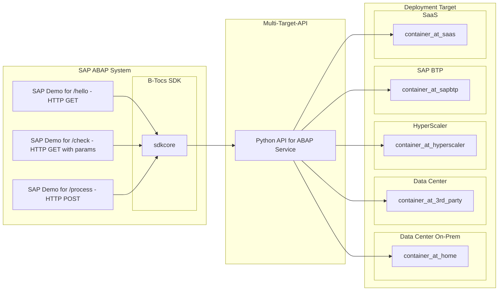

# B-Tocs Python API Template for SAP ABAP 

This repository is a simple template for building Python based APIs for SAP ABAP. The python API based on FastAPI.
For the ABAP side take a look to the project B-Tocs ABAP SDK and the demo code.

## Big Picture

This project handles the following aspects:
1. Create a python based API
2. Call this API from SAP ABAP systems
3. Create a cloud native container for multi target deployment

## Step-By-Step Guide
1. Crete a python based API
    1. [Install requirements - python, git, vsc](doc/requirements.md)
    2. [Create a new python project](doc/new_project.md)
    3. [Check the code and API](doc/check_code_and_api.md)
    4. [Expose API to the internet](doc/expose_api.md)
2. Call this API from SAP ABAP systems 
    1. [Connect SAP to the API](doc/connect_sap.md)
    2. [Call the API endpoints from ABAP programs](doc/call_api_from_sap.md)
    3. [Enable API Debugging](doc/enable_debugging.md)
3. Create a cloud native container for multi target deployment
    1. [Build and start local docker container]()
    2. [Create a container for your api](doc/docker_container.md)
    3. [Deploy the container to a container registry]()
    4. [Use an existing container for a target platform]()

