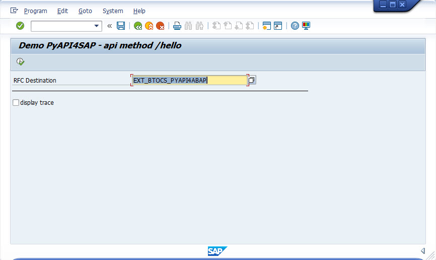
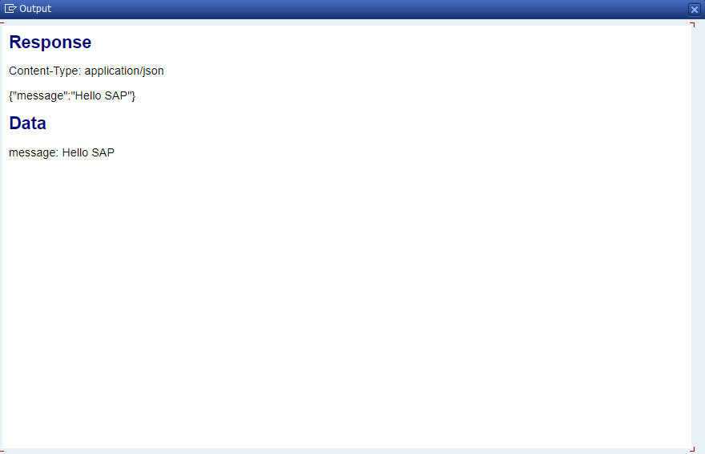
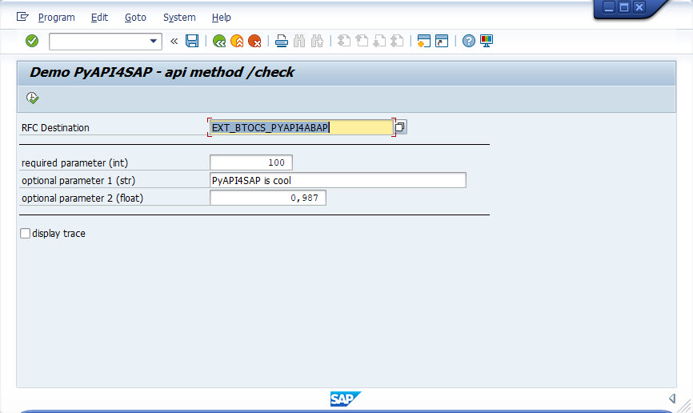
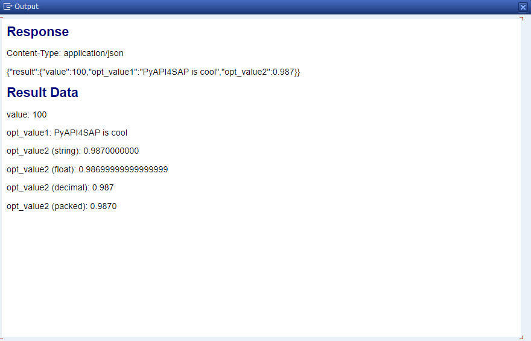
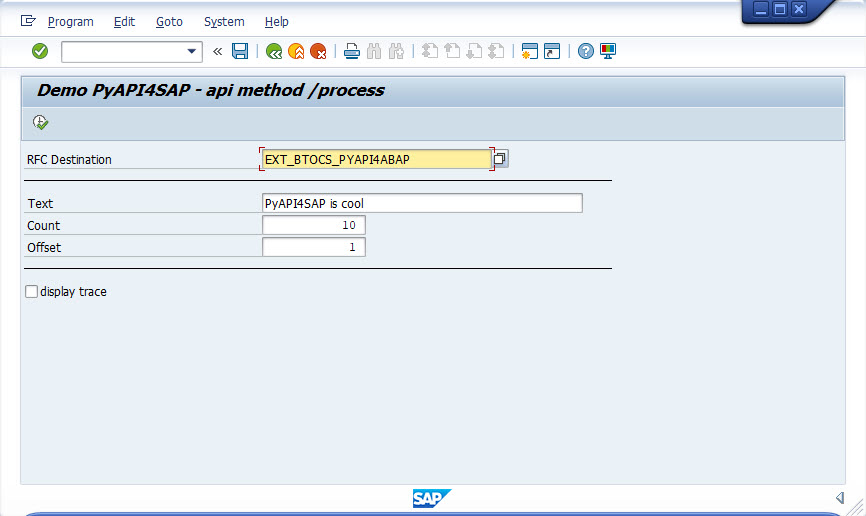
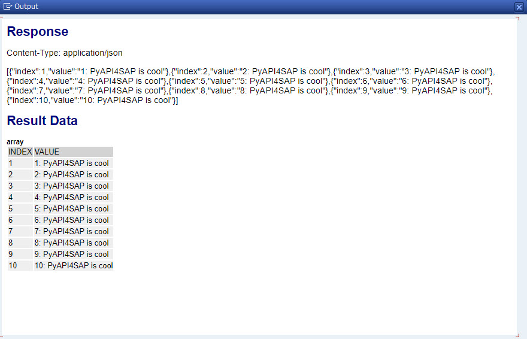

# Call the API from SAP ABAP

In this step calling the python based API service from a SAP ABAP system will be described. A network connecttion from SAP to your API service host is required. Use the ngrok tunnel workaound for local scenarios.
A SM59 destination must be maintained for your serice.

## ABAP reports

An ABAP for every API method can be found in folder "abap". Install these reports with transaction SE38 in your ABAP backend system. Every abap report requires the RFC destination maintained for your API service. The flag "display trace" display the background trace to find errors or see the logger messages.

## API Method "hello"

This method can be tested with report [ZBTOCS_DEMO_PYAPI2SAP_HELLO](../abap/ZBTOCS_DEMO_PYAPI2SAP_HELLO.abap). 

### Parameters
Enter the RFC destination to your service and execute the report. 

### Result

### Learnings

Check the ABAP code for:
- How to create a connector object and set the endpoint
- How to execute a simple HTTP GET request
- How to read the response and response content type as string
- How to reas json objects and get simple string values 
- How to use the logger and the gui utils

## API Method "check"

This method can be tested with report [ZBTOCS_DEMO_PYAPI2SAP_CHECK](../abap/ZBTOCS_DEMO_PYAPI2SAP_CHECK.abap). 

### Parameters

Enter the RFC destination to your service and the API parameter values. Then execute the report.

### Results

### Learnings

Check the ABAP code for:
- How to build a complex HTTP GET path with path and query parameters
- How to hande complex JSON response
- How to get values not like string values from response
- Different options to handle float values

## API Method "Process"

This method can be tested with report [ZBTOCS_DEMO_PYAPI2SAP_PROCESS](../abap/ZBTOCS_DEMO_PYAPI2SAP_PROCESS.abap). 

### Parameters

Enter the RFC destination to your service and the API parameter values. Then execute the report.

### Results

### Learnings

Check the ABAP code for:
- How to handle HTTP POST request
- How to build the JSON request data
- How to handle JSON list of objects response 

## Summary

You know how to execute HTTP GET or POST request against a REST service endpoint. You can build and extract JSON data. 