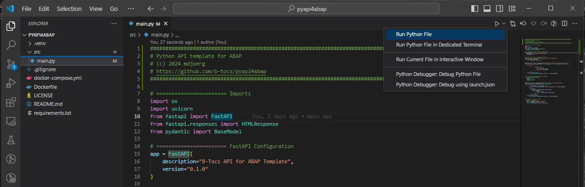
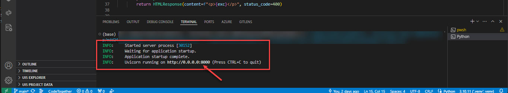
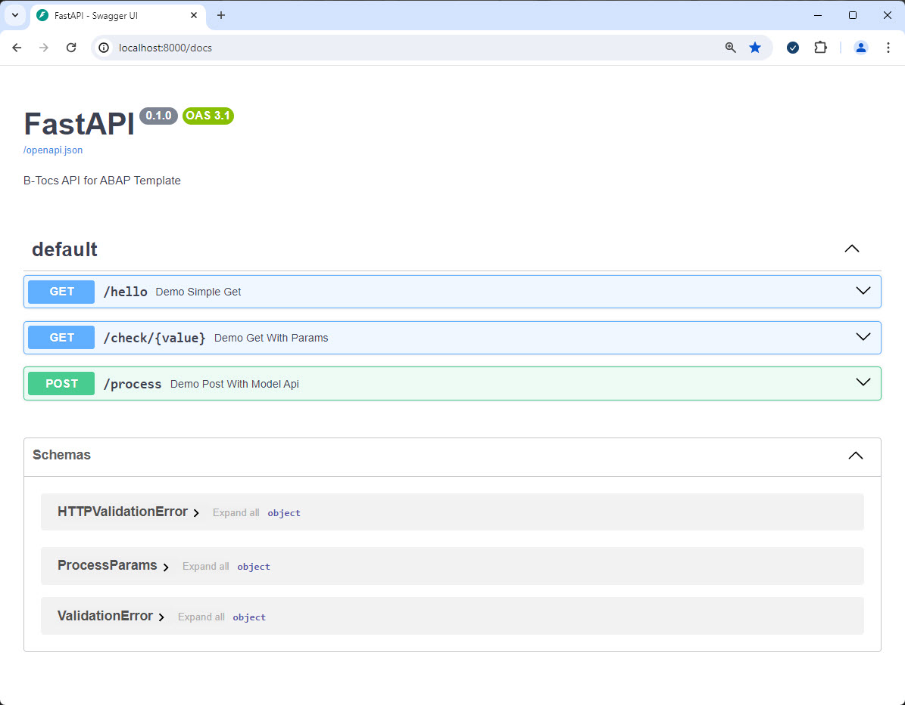
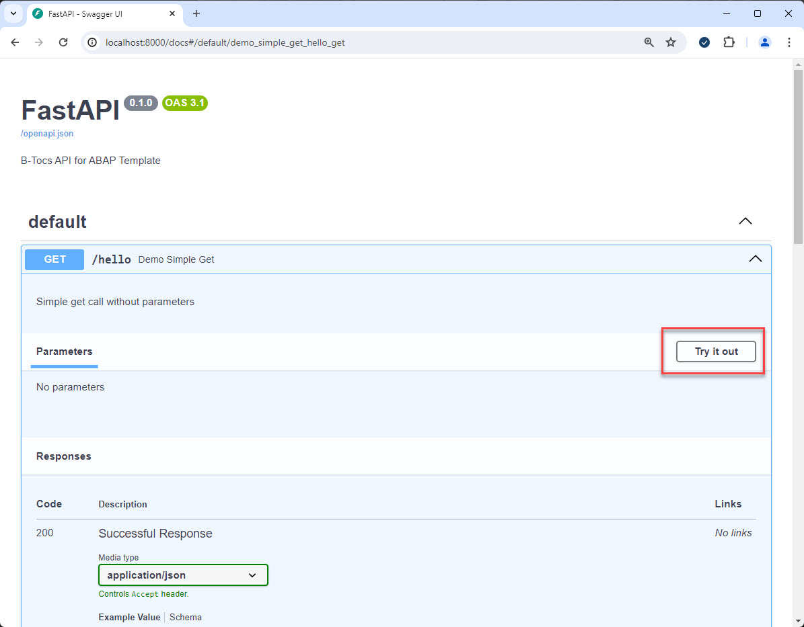

# Start the service and check the API

In this step the python based API service will be started for local testing. You can explore the API endpoints created by the fastapi library and check the code to get this.

## Start API Service

1. Open the main.py in directory src

2. Start the python file

3. The python service should be running now

## Test the Swagger UI (aka OpenAPI)

1. Open the Swagger UI in browser: `http://localhost:8000/docs`

2. Test the the API with the Swagger UI

3. Search the internet for further information about "using the swagger ui"

## Check the Redoc UI

Open the Redoc UI in browser: `http://localhost:8000/redoc`

## Check the code in main.py

1. The following dependencies are used:
    - os: get environment variable for external configuration (e.g. docker container)
    - uvicorn: webserver implementation to serve the api
    - fastapi: api library for building rest api with swagger/openapi support
    - pydantic: framework to declare and validate data models

2. Constants
    - define your constants like version, title, ... here

3. FastAPI configuration
    - the FastAPI framework is initialized here

4. HTTP GET examples
    - you find two example endpoint methods for HTTP Get (`@app.get`)
    - "/hello" is a simple get method without parameters
    - "/check" uses path and request parameters

5. HTTP POST example
    - "/process" is a HTTP POST example with parameters like an SAP function module
    - The parameters are declared by the pydantic model class "ProcessParams"
    - The [pydantic framework](https://docs.pydantic.dev/latest/) supports further options to declare obligatory or optional parameters and typing features  
    - The code contains a example to build and return a python list returned as a json array

6. Startup section
    - The command `if __name__ == "__main__":` is similiar to the java main() method and is used to startup a module
    - In this example the parameters for host and port will be determined from the environment with default values
    - Then the uvicorn webserver will be started to serve the fastapi service

## Summary

You know now how a python based API service can be started in VSC and have a first impression about the code required for this scenario. You have tested the API methods and checked the API documentaion with the built-in Swagger and Redoc UI.
See https://fastapi.tiangolo.com/ for more information about FastAPI.