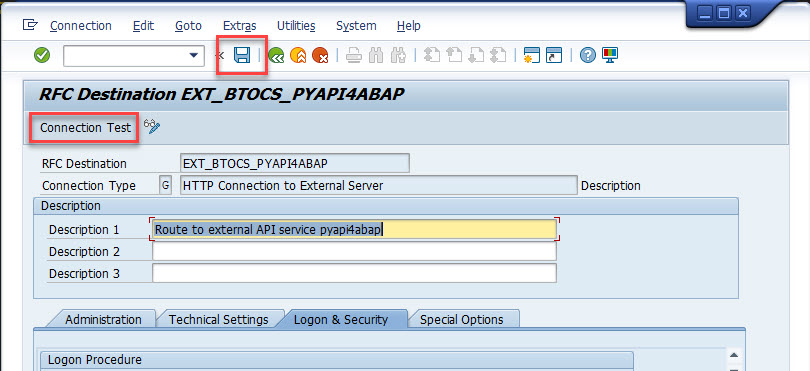

# Connect SAP to the API serv

In this step a connection from an on-premise SAP ABAP system will be established to the API service. A network route between SAP and the API service is required. 
If not a workaround like establishing a tunnel with ngrok could help in developer scenarios.

## Create a RFC destination

1. Open transaction SM59

2. Create a new destination `EXT_BTOCS_PYAPI4ABAP` of type "G".

3. Enter the description, host and port of the API service

4. Enable HTTPS/SSL

If your API service uses HTTPS (Port 443) then an activated SSL in section "Logon and Security" is required.

5. Save

Save the new destination.

## Test RFC Destination

1. Use the "Connection Test" option to test the new destination.

2. A popup could appear to warn for errors

In this case the popup inform abaout a HTTP status code 404 (= "not found"). This is correct because the API service has not implemented the root path "/". But the service is reached and can be used with SAP ABAP.

3. Check the Test details

In section "Test result" a short summary about the request is shown. 

In section "Response Text" the complete reponse with header and body data will be displayed.

## Summary

You know how a connection from on-premise SAP ABAP system can be established to an external HTTP internet service. If required activate SSL. In case of issues with untrusted certificates SAP transaction STRUST is your best friend.
