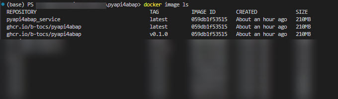
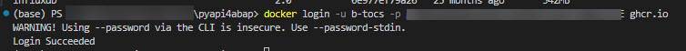
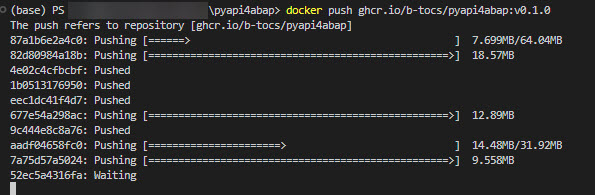
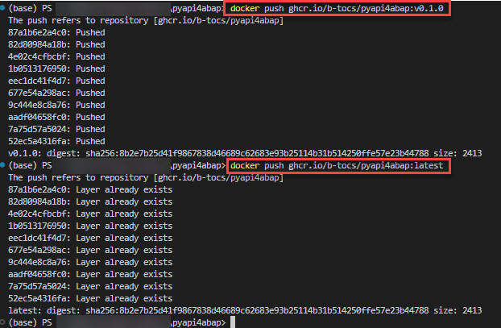
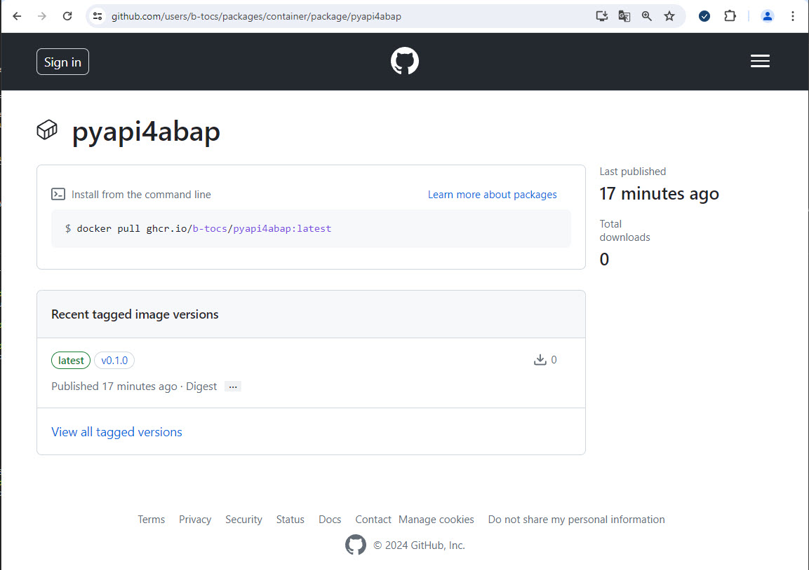

# Deploy a container image to a container registry

In this step the created container image will be forwarded to a [container registry](https://sysdig.com/learn-cloud-native/container-security/what-is-a-container-registry/). In this example the Github Container Registry [ghcr.io](https://ghcr.io) for the [B-Tocs project](https://github.com/b-tocs) will be used.

## Tag the local container image

In former steps the docker container image "pyapi4abap_service" was created. Now this image will be prepared for forwarding it to an external container registry like ghcr.io.

Enter the following "docker tag" commands to tag your image. Replace the registry, account, image name and release information for your needs. 

```bash
docker tag pyapi4abap_service ghcr.io/b-tocs/pyapi4abap:v0.1.0
docker tag pyapi4abap_service ghcr.io/b-tocs/pyapi4abap:latest
```

Enter `docker image ls` to see the available local images.



You should see multiple container images identified by the unique "IMAGE ID" using different tags.

## Login to your container registry

To upload a container image to a container registry you have to be authorized. This can be done with the command:

```bash
docker login -u <your account> -p <your_password_or_token> <container registry>
```

Replace the placeholder with your information.



## Upload images to container registry

Now upload ("push") all images tagged before with command "docker push":

```bash
docker push <tagged_image_to_push>
``` 

Progress indicators document the cuurent state of the upload.



After completing all uploads the different uploading tasks returned with "Pushed". Uploading the same image with another image tag no update is required. The uploading tasks will finish with "Layer already exists".



## Check and configure your image

Depending on your container repository some configuration could be missing. Login to your registry and check it. 

In this example github and the ghcr.io was used. After maintaining the required configuration (e.g. made the package visible) the python based API is available as a docker container image to the cloud native world.



With a simple command like `docker pull ghcr.io/b-tocs/pyapi4abap:latest` everybody can use the image in a container runtime environment like docker or kubernetes.


## Summary

You know now how your python based API can be distributed to container registries like ghcr.io in order to use your code fast and simple.
