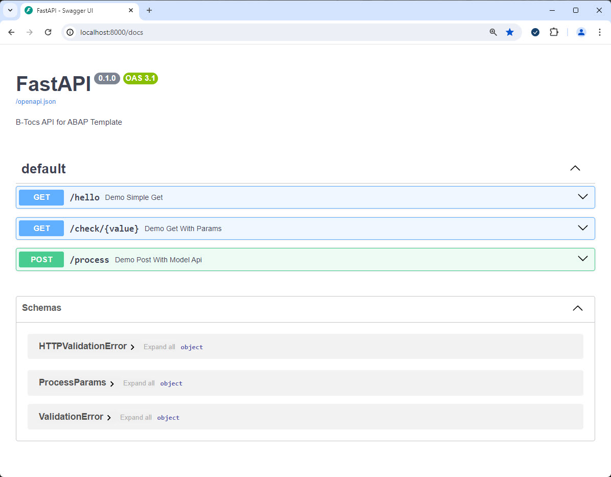

# Build and start a local docker container

In this step the python based API will be containerized. A container can be used locally or in different deployment scenarios.

## Requirements

A local installation of a docker environment is required. See the docker [docs](https://docs.docker.com/get-docker/) for more information.
If you want to use a alternative like [podman](http://podman.io/) the tasks are roughly similar.

## Build a container for the python service and start it via "compose"

1. Open the Docker Desktop App and check if docker engine is running
2. Enter a VSC terminal and the root path of the python project. 
3. Enter the command:
```bash
docker compose up -d
```

The required files are downloaded and the container will be built.


## Check the running container in Docker Desktop

Open Docker Desktop and check the "Containers" section for the pyapi4abap API service.


You see:
1. The build image is "pyapi4abap_service" and the container "api-1" in docker compose project "pyapi4abap" should be reachable through port 8000.

## Test the service from local docker

Open a web browser and open <http://localhost:8000/docs>. The already known swagger api should appear.



The test from a remote system like SAP can be made if the localhost is reachable. Use the proxy workaround with "ngrok" here as descibed before.

## Stop the local python container

Go to the VSC terminal and enter:

```bash
docker compose down
```

The service in docker desktop should be stopped.


## Optional: Build the container without compose

The "docker compose" command build a new docker image and start it in one step. If you want to create the container image based on the current python code without docker compose use the following command from the VSC terminal window in the project root folder.

```bash
docker build -t pyapi4abap_service .
```

## Check the docker image

Go to the Docker Desktop App and check the section "Images" for the created container image.


## Summary

You know how a python API could be containerized for local testing. The built image could be used for multi target deployments. Check the documentation "Deploy the container image to a container registry".