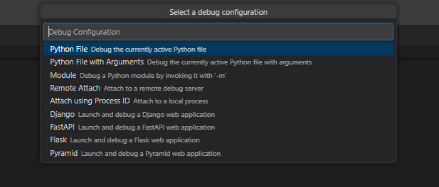

# Debugging

In this step the current api service will be debugged. This is very helpful to find errors between the calling process - e.g. SAP - and the service.

## Set a breakpoint

To stop a program at a specific code line a breakpint is required. In VSC a click at the left border is used to set a breakpoint. See the screenshot for a breakpoint in API method "/check".

.

## Start the service in debugging mode

Stop the current service process via CTRL-C if running. Then start the service in debugging mpde via menu "Run - Start Debugging".

Select the python debugger.

Select the debug configuration "Python file".

Then the service will bet started in debug mode.

## Call the API and debug

Now the API method can be called to activate the debugger. If no remote system is involved the Swagger UI can be used.

The debugger is triggered and can be used to check the code and find bugs.

## Summary 

You know how the VSC python debugger is used.