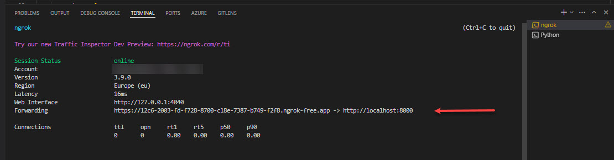
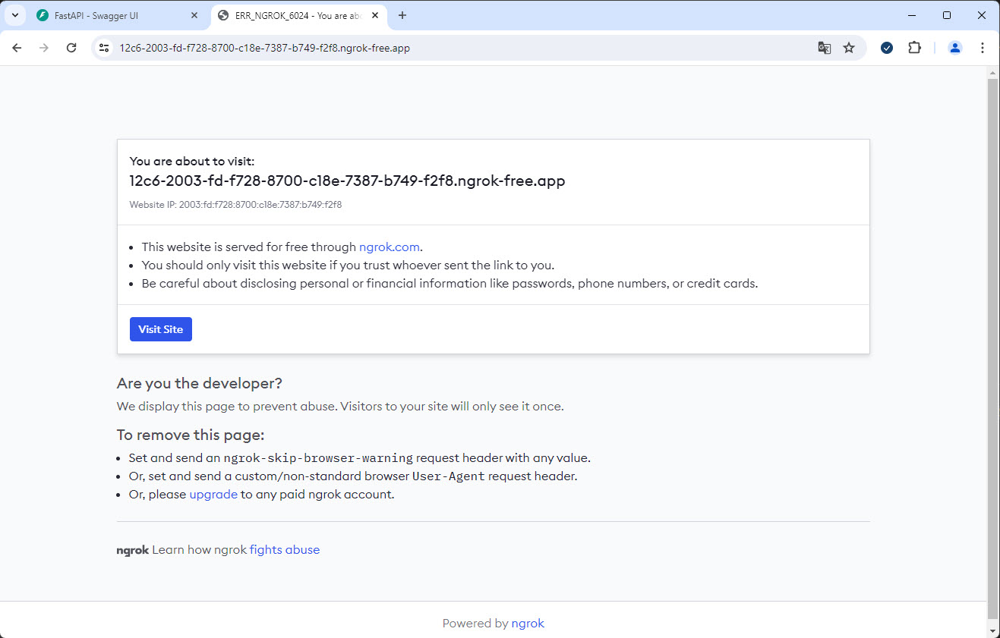
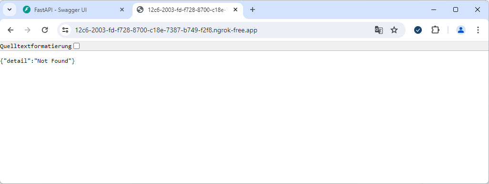
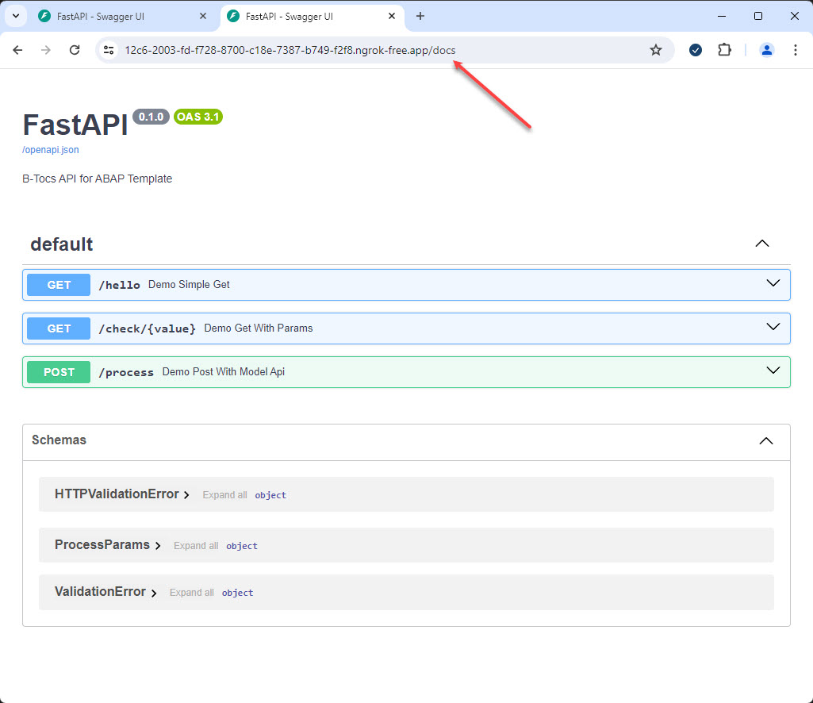

# Expose the API to the internet

The python based API service is running locally now. But a SAP system running in a data center can't use this. In this step the tool NGROK is used to expose the local api to the internet for testing issues.

## 1. Download 

Donwload the binary for your platform from the [NGROK Website](https://ngrok.com/download). Unzip and save the binary in your project folder or in a central folder which is included in the system search path. 

Register and get an auth token like described.

## 2. Set the auth token

See the [ngrok documenation](https://ngrok.com/download).

```bash
ngrok config add-authtoken <token>
```

## 2. Start a tunnel

You can use the VSC terminal for starting the tunnel if you have saved the ngrok.exe here. Otherwise the path to ngrok.exe have to be added.

```bash
ngrok.exe http 8000
```

The ngrok tunnel will be created and a URL to open the local port 8000 from the internet is shown.



## 3. Open the public URL in a Browser

Enter the URL from 2. in a web browser. The following page will be appear. Confirm here with "Visit Site".



After confirming a page like this should appear. 



Add the path "/docs" to the URL to get the Swagger UI -> "https://your-ngrok-url/docs". The Swagger UI should appear and is open fpr the public now!




## Summary

You know now how a local service ca be exposed to the internet by using tools like ngrok.
