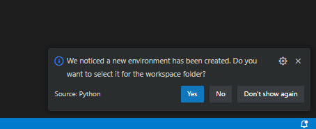

# Create a new python project

In this step you will create a new project folder based on the pyapi4abap template. 

## Clone github repostory and open Visual Studio Code (VSC)

1. Open a command line and go to your projects path
    - Alternative: create a new folder and enter the folder with command line
2. Clone this repository: `git clone https://github.com/b-tocs/pyapi4abap.git`
3. check the current path: `dir` (for linux use `ls`)
4. Go to the new directory `pyapi4abap`
5. Enter `code .` to open the project with VSC
6. Confirm the "Trust the autor" popup

## Initialize python environment

1. Open a terminal within VSC - menu `Terminal - New Terminal` - the path of your project should be active

2. Create a virtual python environment to separate it from other projects
    There are some tools like "conda" to automate this. Because there are issues with special characters the standard python way is used here.
    Option 1: use the default python version: `python.exe -m venv .venv`
    Option 2: use the given python version: `path-to-your-python-version\python.exe -m venv .venv`
    A new folder ".venv" is created.

3. Confirm the VSC popup to use this environment for this project

4. Activate the new environment for the terminal: `.\.venv\Scripts\activate`

5. Upgrade pip: `python.exe -m pip install --upgrade pip`

6. Install the requirements: `pip install -r requirements.txt`

## Summary

Now you can create new python projects with virtual environments.