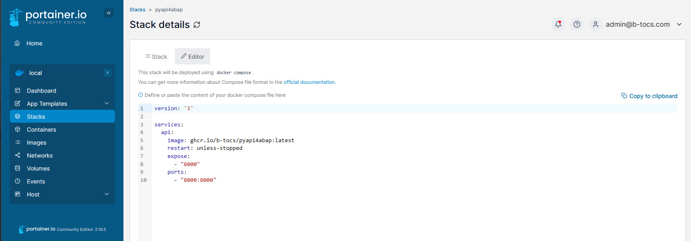

# Use an existing container image

In former steps a python based API was containerized and uploaded to a container registry like ghcr.io. In this step the container image was used to start the API service in different platform scenarios.

## Start the container image locally with docker

The latest container image of the pyapi4abap example can be started for a docker environment with command:

```bash
docker run -p 8000:8000 --name pyapi4abap_service ghcr.io/b-tocs/pyapi4abap:latest
```

Add a `-d` after `run`option for start the container in background mode.

The API service will be started. Open <http://localhost:8000/docs> in a local webserver to see the swagger UI and test the API.


## Start the container as portainer stack

[Portainer](https://www.portainer.io/) is a well known orchestration platform for container management. If you are using portainer on top of a docker host you can add a new stack and run the pyapi4abap service in your network or as cloud service.

Add a new stack "pyapi4abap" and use the following compose snippet:

```yaml
version: '3'

services:
  api:
    image: ghcr.io/b-tocs/pyapi4abap:latest
    restart: unless-stopped 
    expose:
      - "8000"
    ports:
      - "8000:8000"
```



After deploying the swagger UI should be available at <http://yourhost:8000/docs>.

Tipp: you should secure the service with a reverse proxy with authorization control.


## Start pyapi4abap service in other environments

Docker container are a industry staandard and are supported by all modern operation platforms. With the knowledge of the container image the api service can be deployed in different variants. Search for "docker container" or "kubernetes" support for your used platforms.

## Summary

You should be able to execute a docker container image in different environments.